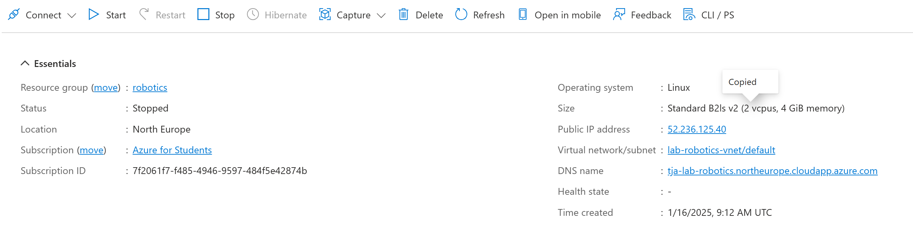
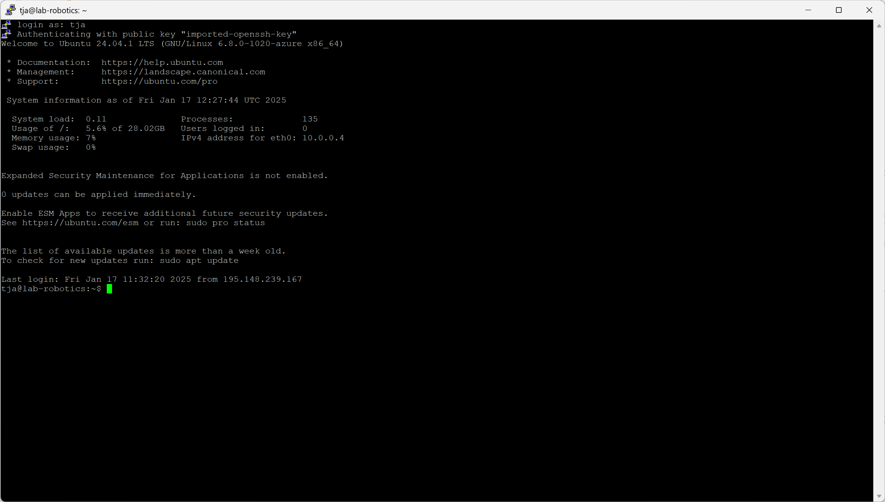
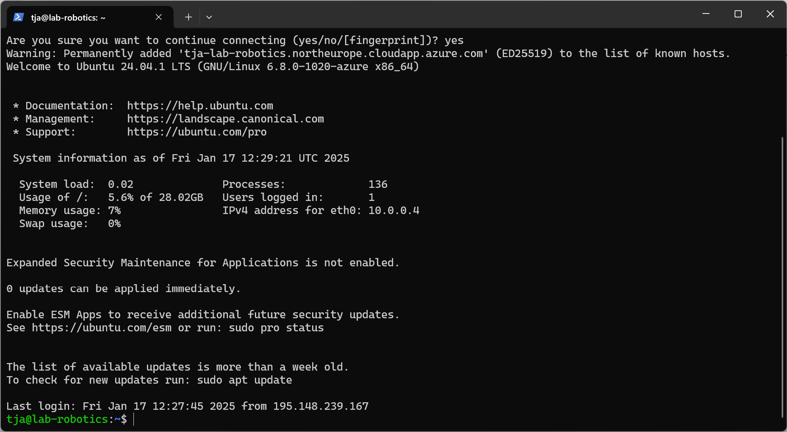

# Linux machine installation

My linux machine uses Azure size Standard_B2ls_v2 machine. I'm using Ubuntu Canonical Marketplace image for the vm and more specifically a Ubuntu 24.04 LTS server image with out graphical user interface. 

Image 1 shows Machine connection details

I've successfully connected to my machine using both putty

to use PuTTY, I needed to convert my PEM formated private key to PPK file. This was complished using puttyGenp

And Windows 11 ssh client

